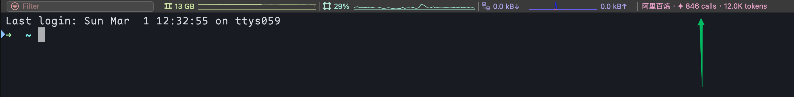

# iTerm2 CC Status

iTerm2 状态栏组件，用于显示 [cc-switch](https://github.com/farion1231/cc-switch) 代理记录的 LLM 使用统计（调用次数与 token 数）。展示当前提供商与最近 30 天用量，点击状态栏可查看详情弹窗。

**[English](../README.md)**

### 使用效果



---

## 环境要求

- **iTerm2**（需开启 Python API）
- **Python 3.6+** — iTerm2 会用你系统里的 Python 运行本脚本；若未安装可从 [python.org](https://www.python.org/) 或执行 `brew install python3`
- **cc-switch** 代理，且 SQLite 数据库位于 `~/.cc-switch/cc-switch.db`

## 在 iTerm2 中的使用方法

### 1. 安装 Python 与依赖

先确认已安装 Python 3（`python3 --version`）。再安装脚本依赖：

```bash
pip install -r requirements.txt
# 或：pip3 install -r requirements.txt
```

### 2. 开启 iTerm2 Python API

在 iTerm2 中：

- 打开 **偏好设置**（⌘,）→ **General** → **Magic**
- 勾选 **Enable Python API server**

### 3. 安装脚本

将两个 Python 文件都复制到 iTerm2 的 Scripts 目录，以便正确导入 `db_reader`：

```bash
# 若不存在则先创建 Scripts 目录
mkdir -p "$HOME/Library/Application Support/iTerm2/Scripts"

# 复制两个脚本（项目根目录 = 你克隆本仓库的路径）
cp iterm2_llm_status.py db_reader.py "$HOME/Library/Application Support/iTerm2/Scripts/"
```

### 4. 添加状态栏组件

1. 在 iTerm2 菜单：**Scripts** → **iterm2_llm_status.py** → **LLM Status**
2. 或：**Scripts** → **Manage** → 选中 **iterm2_llm_status.py**，运行 **LLM Status**
3. 在状态栏区域点击 **+**（或 **Add Component**），添加 **LLM (30d)**

状态栏会显示类似：`ProviderName · ✦ 42 calls · 1.2K tokens`（每 3 秒刷新）。点击可打开弹窗查看提供商、调用次数和 token 数。

## 数据来源

统计数据来自 cc-switch 写入的 SQLite 数据库：

- **路径：** `~/.cc-switch/cc-switch.db`
- **使用的表：** `proxy_request_logs`、`providers`

若数据库不存在或为空，组件会显示 `✦ — 0 calls · 0 tokens`。

## 配置

在 `iterm2_llm_status.py` 中可修改：

- `APP_TYPE`：应用类型过滤（默认 `"claude"`）
- `REFRESH_INTERVAL`：状态栏刷新间隔（秒），默认 `3`

## 文件说明

| 文件 | 说明 |
|------|------|
| `iterm2_llm_status.py` | iTerm2 状态栏组件入口 |
| `db_reader.py` | 读取 cc-switch SQLite 数据库并格式化用量统计 |

## 许可证

可自由使用与修改。
